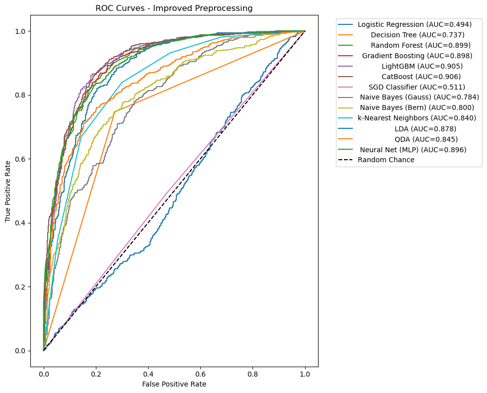

# ExoBoost: Exoplanet Classification Models

An ensemble of machine learning models trained on *NASA's open-source exoplanet datasets* for classifying exoplanet candidates.

---

## Model Training Summary

This project utilized a comprehensive dataset to train and evaluate multiple classification algorithms.

| Metric | Value |
| :--- | :--- |
| *Training Date* | 2025-09-30 04:25:59 |
| *Training Samples* | 3178 |
| *Test Samples* | 1363 |
| *Features* | 34 |

---

## Model Performance Summary

The models were evaluated based on standard classification metrics. *CatBoost* was identified as the *best performing model* and is saved as best_model.pkl.

| Model | Accuracy | Precision | Recall | F1 Score | ROC-AUC |
| :--- | :--- | :--- | :--- | :--- | :--- |
| *CatBoost* | *0.833456* | 0.818811 | 0.860465 | 0.839121 | *0.906404* |
| LightGBM | 0.836390 | 0.819807 | 0.866279 | 0.842403 | 0.905017 |
| Random Forest | 0.818048 | 0.814286 | 0.828488 | 0.821326 | 0.898789 |
| Gradient Boosting | 0.823184 | 0.809986 | 0.848837 | 0.828957 | 0.897937 |
| Neural Net (MLP) | 0.812179 | 0.800000 | 0.837209 | 0.818182 | 0.896494 |
| LDA | 0.804842 | 0.793872 | 0.828488 | 0.810811 | 0.878030 |
| QDA | 0.718269 | 0.666302 | 0.885174 | 0.760300 | 0.844830 |
| k-Nearest Neighbors | 0.770360 | 0.740693 | 0.838663 | 0.786639 | 0.840171 |
| Naive Bayes (Bern) | 0.738811 | 0.738506 | 0.747093 | 0.742775 | 0.799632 |
| Naive Bayes (Gauss) | 0.495965 | 0.666667 | 0.002907 | 0.005789 | 0.783730 |
| Decision Tree | 0.737344 | 0.736390 | 0.747093 | 0.741703 | 0.737250 |
| SGD Classifier | 0.510638 | 0.515933 | 0.494186 | 0.504826 | 0.510797 |
| Logistic Regression | 0.489362 | 0.494318 | 0.505814 | 0.500000 | 0.494447 |

---

## How to Load and Use the Models

The models are saved using joblib. You can load the *best model* (best_model.pkl) and use it for predictions on new, appropriately scaled data.

### Prerequisites

You will need the following libraries:
- joblib
- pandas

### Usage Example

```python
import joblib
import pandas as pd
import numpy as np

# Load a model
# 'best_model.pkl' is the CatBoost classifier
try:
    model = joblib.load('best_model.pkl')
except FileNotFoundError:
    print("Error: 'best_model.pkl' not found. Please ensure the model file is in the same directory.")
    exit()

# Note: The input features for prediction MUST be scaled in the same way 
# as the training data, with values falling within the min/max ranges provided below.
# A proper implementation would use a saved scaler object, but for this example,
# we use placeholder values within the expected range.

# Example of new data (replace with your actual scaled data)
# For this example, we'll use the minimum values for a new hypothetical exoplanet.
X_new_data = {
    "koi_period": -0.389486,
    "koi_period_err1": -0.249980,
    "koi_time0bk": -0.509194,
    "koi_time0bk_err1": -0.651946,
    "koi_impact": -0.630537,
    "koi_impact_err1": -0.666667,
    "koi_impact_err2": -3.567234,
    "koi_duration": -1.031911,
    "koi_duration_err1": -0.692735,
    "koi_depth": -0.572557,
    "koi_depth_err1": -0.723214,
    "koi_prad": -1.142857,
    "koi_prad_err1": -0.723404,
    "koi_prad_err2": -3.689655,
    "koi_teq": -1.433444,
    "koi_insol": -0.312844,
    "koi_insol_err1": -0.261479,
    "koi_model_snr": -0.675000,
    "koi_steff": -3.652231,
    "koi_steff_err1": -1.500000,
    "koi_steff_err2": -3.494382,
    "koi_slogg": -3.687500,
    "koi_slogg_err1": -0.693333,
    "koi_slogg_err2": -3.685185,
    "koi_srad_err1": -0.941748,
    "koi_srad_err2": -3.696721,
    "ra": -1.479197,
    "dec": -1.327027,
    "koi_kepmag": -3.649838,
    "depth_to_srad": -0.479075,
    "prad_to_srad_ratio": -1.007994,
    "period_to_impact": -0.239422,
    "log_insol": -1.665119,
    "log_snr": -1.799029
}

X_new = pd.DataFrame([X_new_data])

# Make predictions
predictions = model.predict(X_new)
probabilities = model.predict_proba(X_new)

print(f"Prediction: {predictions[0]}")
print(f"Probabilities (Class 0, Class 1, etc.): {probabilities[0]}")



